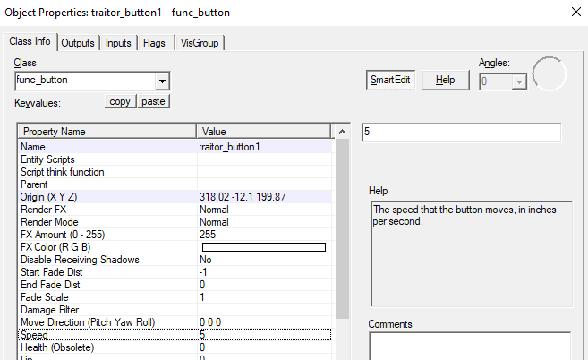
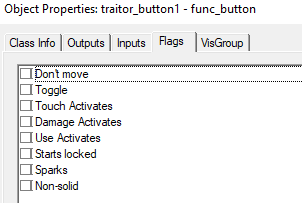

# T Buttons

Making a T Button is extremely simple in the new plugin.

First, make a `func_button` that you want to be the traitor button.

Afterwards, name it `traitor_button1` \(Note: The `1` can be whatever number you want, I just like to order them correctly\).

We now have a T Button, but before you release a map, you need to make sure every flag is **NOT TICKED** in order to have the button work with the plugin \(with this in mind, it is obvious that when you are testing your map, T traps will not work unless you turn `Use activates` on, so if you are planning to release a map with traps, make sure you turn use activates off after you are done testing\).

Your flags should look like this:

And done, you can now add outputs to your button, and it will only be activated by T's.

[Text](https://steam-gamers.net/forums/topic/97622-csgo-ttt-traitor-testers-t-buttons-and-t-doors/) was written by [20 scrolls](https://steam-gamers.net/profile/21544-20-scrolls/). He allowed us to copy his text for making this public.

