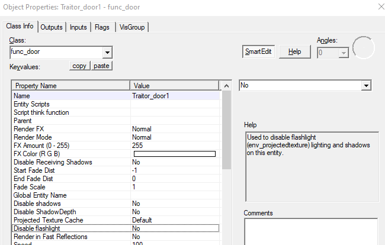
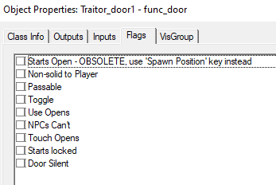
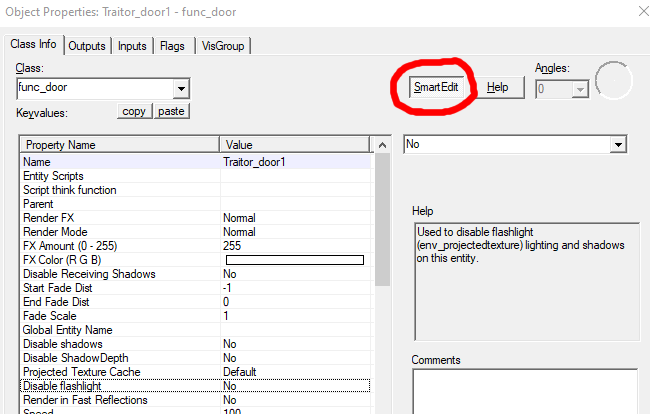
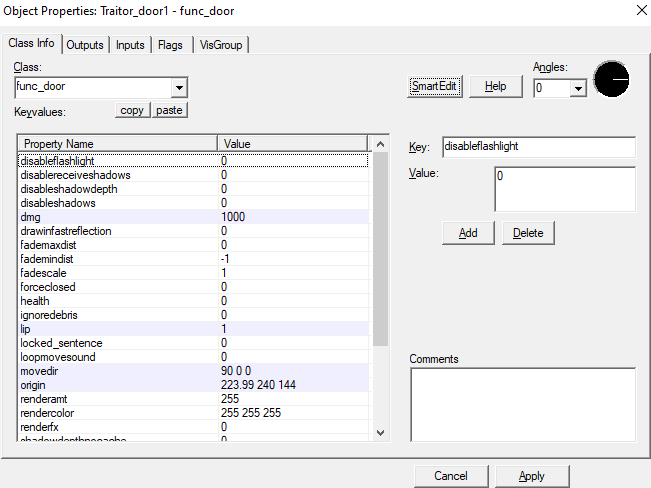
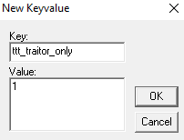

# T Doors

T Doors are almost identical to T Buttons, except there is 1 neat extra feature.

First make a `func_door`, and name it `traitor_door1` \(again, the `1` can be whatever number\).

Then head over to the flags tab, and make sure every flag is **ticked off**:

And boom, you now have a traitor only door. Now, the neat extra feature that I mentioned before is the `ttt_traitor_only` keyvalue. This keyvalue makes it so the door can only be activated once you are near it \(by default, the doors can be opened from far away\). Here is how you implement it:

First, open your door properties, and click on `SmartEdit`:

And you should now see something that looks like this:

Now click on the \`Add\`-button, and in \`Key\`, paste `ttt_traitor_only`in, and then in Value, delete `value` and put `1` in.

After that, click `Ok`, then apply, and then click on `SmartEdit` again to turn it back on.

