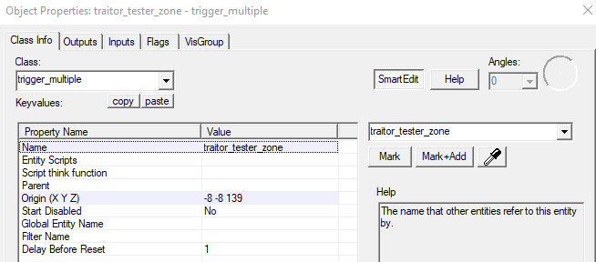
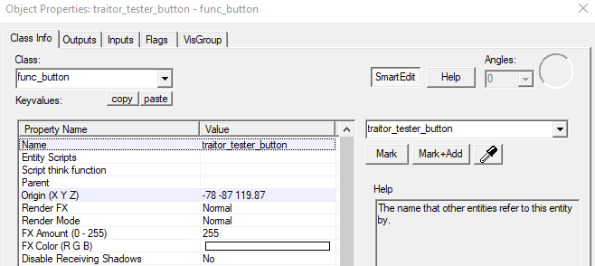
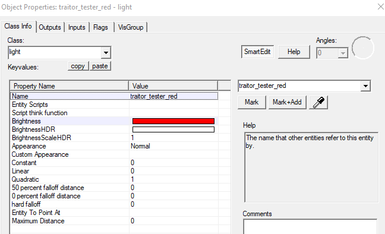
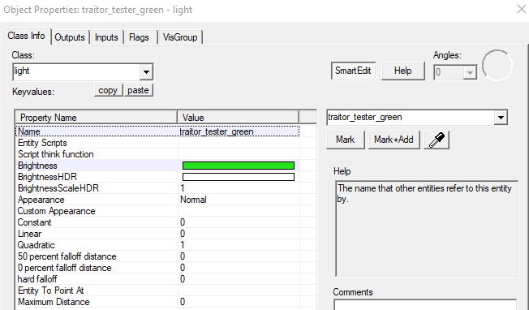

# T Tester

To create a T tester, you will need the following entities:

* trigger\_multiple
* func\_button
* light
* light

First, start off by making a `trigger_multiple`, and naming it `traitor_tester_zone`, as the name implies, this is where the player will stand inside of, when getting tested.

Then, make a `func_button`, and name it `traitor_tester_button`, this button will be used to activate the tester zone.

After you have created both of those entities, create 2 `light` entities, color one red \(255 0 0\), and the other green \(0 255 0\). Then name the red one `traitor_tester_red`, and name the green one `traitor_tester_green` \(see below for examples\).

And boom, no outputs are needed for the entities, as the plugin handles it all.

\_\_[_Text_](https://steam-gamers.net/forums/topic/97622-csgo-ttt-traitor-testers-t-buttons-and-t-doors/) _was written by_ [_20 scrolls_](https://steam-gamers.net/profile/21544-20-scrolls/)_. He allowed us to copy his text for making this public._

